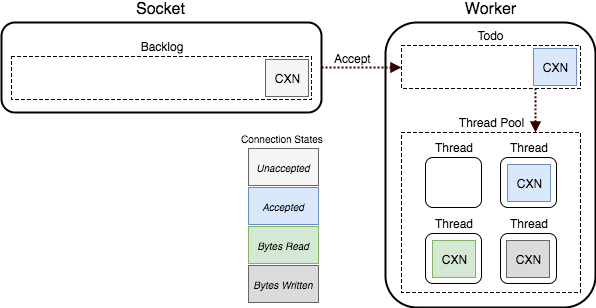

# Architecture

## Overview

Puma is a threaded Ruby HTTP application server processing requests across a TCP
and/or UNIX socket.

Puma processes (there can be one or many) accept connections from the socket via
a thread (in the [`Reactor`](../lib/puma/reactor.rb) class). The connection,
once fully buffered and read, moves into the `todo` list, where an available
thread will pick it up (in the [`ThreadPool`](../lib/puma/thread_pool.rb)
class).

Puma works in two main modes: cluster and single. In single mode, only one Puma
process boots. In cluster mode, a `master` process is booted, which prepares
(and may boot) the application and then uses the `fork()` system call to create
one or more `child` processes. These `child` processes all listen to the same
socket. The `master` process does not listen to the socket or process requests -
its purpose is primarily to manage and listen for UNIX signals and possibly kill
or boot `child` processes.

We sometimes call `child` processes (or Puma processes in `single` mode)
_workers_, and we sometimes call the threads created by Puma's
[`ThreadPool`](../lib/puma/thread_pool.rb) _worker threads_.

## How Requests Work

* Upon startup, Puma listens on a TCP or UNIX socket.
  * The backlog of this socket is configured with a default of 1024, but the
    actual backlog value is capped by the `net.core.somaxconn` sysctl value.
    The backlog determines the size of the queue for unaccepted connections. If
    the backlog is full, the operating system is not accepting new connections.
  * This socket backlog is distinct from the `backlog` of work as reported by
    `Puma.stats` or the control server. The backlog that `Puma.stats` refers to
    represents the number of connections in the process' `todo` set waiting for
    a thread from the [`ThreadPool`](../lib/puma/thread_pool.rb).
* By default, a single, separate thread (created by the
  [`Reactor`](../lib/puma/reactor.rb) class) reads and buffers requests from the
  socket.
  * When at least one worker thread is available for work, the reactor thread
    listens to the socket and accepts a request (if one is waiting).
  * The reactor thread waits for the entire HTTP request to be received.
    * Puma exposes the time spent waiting for the HTTP request body to be
      received to the Rack app as `env['puma.request_body_wait']`
      (milliseconds).
  * Once fully buffered and received, the connection is pushed into the "todo"
    set.
* Worker threads pop work off the "todo" set for processing.
  * The worker thread processes the request via `call`ing the configured Rack
    application. The Rack application generates the HTTP response.
  * The worker thread writes the response to the connection. While Puma buffers
    requests via a separate thread, it does not use a separate thread for
    responses.
  * Once done, the thread becomes available to process another connection in the
    "todo" set.

### `queue_requests`

The `queue_requests` option is `true` by default, enabling the separate reactor
thread used to buffer requests as described above.

If set to `false`, this buffer will not be used for connections while waiting
for the request to arrive.

In this mode, when a connection is accepted, it is added to the "todo" queue
immediately, and a worker will synchronously do any waiting necessary to read
the HTTP request from the socket.
